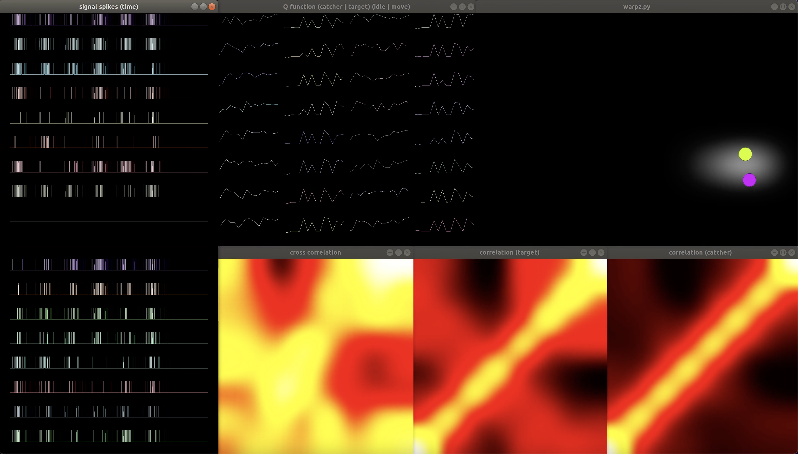
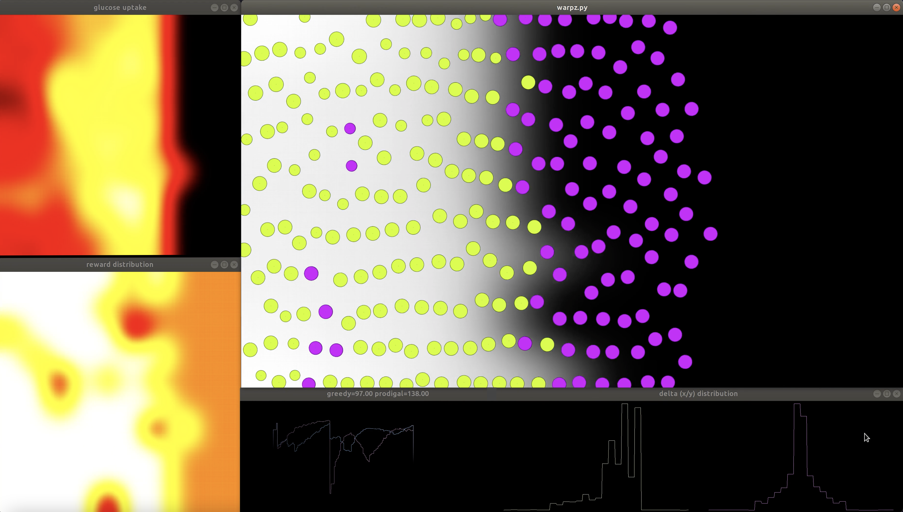
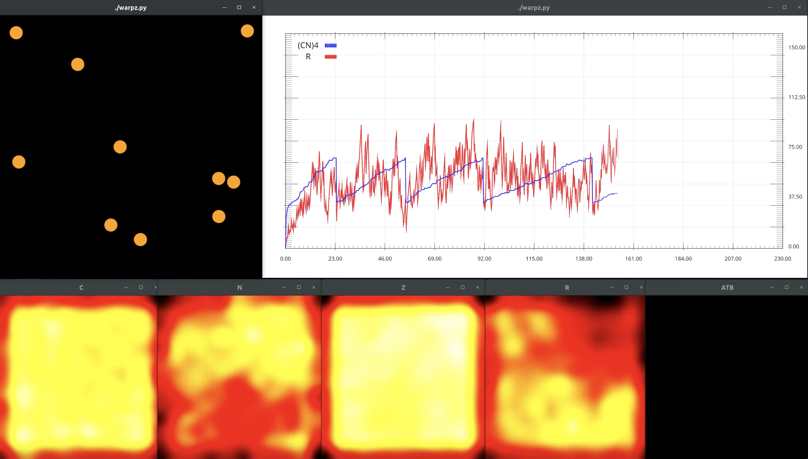

# warpz

It is in our essence to formulate questions about the underlying mechanisms from which our reality came to be. This is the starting point for the development of ontological frameworks with formal elements to gain deeper insights about what there is, given that we don’t know what it is.

Many of the phenomena we are interested in understanding are manifestations of collection of entities interacting and building boundaries creating systems with emergent properties to sense and interact with the rest of the environment. What emerges can further self-organize and create new boundaries giving existence to novel entities with the same capabilities in different contexts of reality.

A good example of this phenomena are billions of neurons acting as decision units cooperating to produce complex information processing tasks which are beyond the capabilities of each one as a single individual entity. Collective cell migration is another example where the coordinated movement emerging from the exchange of chemical and mechanical signals between cells plays an essential role in tissue formation and repair.

In both examples, we perceive biological cells as autonomous units with the ability to respond to changes in the environment, tuning its behavior and manifesting to us as an entity with a remarkable degree of adaptation.

The motivation of this work comes as a quest into the exploration of frameworks to model autonomy and adaptation in biological cells, which are distinctive properties that make them substantially different from other building blocks of fundamental theories of reality.

